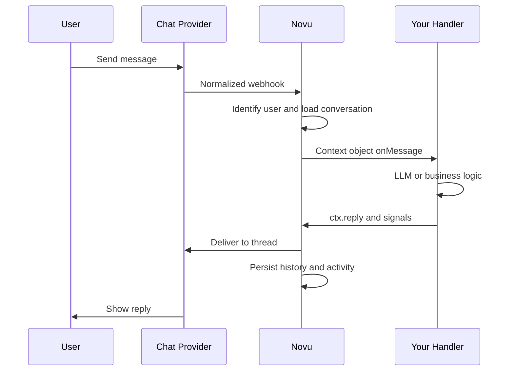

These are the ideas behind Novu for Agents (Agent Communication Infrastructure, or ACI). You write handler code; Novu handles providers, delivery, and conversation state.

## Inbound flow

Users can message your agent, and your agent can message back. When someone interacts on a connected platform, Novu resolves identity and conversation state, forwards a context object to your server, then delivers your reply to the right thread.

| Step | What Novu does |
| --- | --- |
| **Receive and identify** | Normalizes the platform webhook. Maps the platform user (for example a Slack user ID) to a Novu subscriber when possible. Known users get full profiles; unknown users stay anonymous until resolved. |
| **Load conversation** | Creates or loads the conversation for that thread. Assembles message history, metadata, and subscriber data into one context object. |
| **Your handler** | Calls your code with message, history, subscriber, and platform details. You run your LLM or business logic and call `ctx.reply()`. |
| **Deliver and persist** | Sends the reply to the provider thread, stores it in history, and logs activity in the dashboard. |

Your server never calls Slack, Teams, or email APIs directly. It gets a context object and returns a reply; Novu handles the rest.

## Key entities

### Agent

The dashboard object that connects your code to one or more chat providers. Each agent has a name, identifier, and event handlers.

It does not define your model, prompts, tools, or business rules. It is the bridge to the app where that logic lives. The provider is where the user chats; the agent is how your app responds.

### Provider connection

Credentials and config that link an agent to a platform (Slack, Teams, WhatsApp, email, and others).

Setup and capabilities differ per provider (reactions, typing indicators, attachments, cards, message edits, and so on). Novu normalizes inbound events before your handler runs, so you work with one interface instead of provider-specific webhooks. Your handler code stays provider-agnostic; Novu translates outbound replies per platform.

### Conversation

The stateful thread for a chat. Novu creates or loads it when a message arrives. It holds history, metadata, participants, status, and platform context.

The agent is a participant, not the conversation itself (relevant when you read threads in the dashboard). A Slack thread, email thread, or similar maps to one Novu conversation.

**Lifecycle:** **Active** from the first message until resolved. **Resolved** when the agent emits the resolve signal (`onResolve` runs; optional summary stored). **Reopened** automatically if the user messages again after resolution.

### Participants and identity

Novu maps platform users to subscribers when it can:

- **Match found:** handler gets subscriber ID, name, email, and related fields.
- **No match:** user is tracked as a platform user; write handlers that tolerate missing subscriber data.

Later resolution upgrades them to a full subscriber. Identity is provider-aware (Slack user ID vs email sender, and so on) but can resolve to one subscriber record. Use it for personalization, account lookup, and escalation rules.

## Bridge surface

The same handler API applies no matter which provider sent the event or which model you use.

### Event handlers

| Handler | When it runs | Typical use |
| --- | --- | --- |
| `onMessage` | User sends a message | Process text and reply |
| `onAction` | User clicks a button or selects from a card | Forms, buttons, dropdowns |
| `onReaction` | User adds or removes a reaction | Feedback, follow-ups |
| `onResolve` | Conversation marked resolved | Cleanup, analytics, summary |

Handlers connect Novu's delivery layer to your app. An `onMessage` handler might pass context to an LLM and return a reply through Novu.

### Context object

Each handler receives a context with some or all of:

- Incoming message
- Conversation state and metadata
- Resolved subscriber (when available)
- Recent history
- Provider and platform details (thread, channel IDs)
- Methods to reply, set metadata, trigger workflows, or resolve

That object is the only interface your code needs. You do not integrate Slack, Teams, WhatsApp, or email separately in the handler.

### Replies vs signals

**Replies** are user-visible messages: plain text, markdown with files, or interactive cards (buttons, dropdowns, links, inputs). Card interactions fire `onAction` with `actionId` and value.

**Signals** update state without necessarily sending another chat message:

| Signal | What it does |
| --- | --- |
| Metadata | Key-value data on the conversation, persists across turns |
| Trigger | Starts a Novu workflow from the thread |
| Resolve | Marks the conversation resolved, optional summary |

Replies talk to the user; signals update the system around the conversation. One handler turn can reply, set metadata, trigger a workflow, and resolve.

Signals queue in memory and batch with your next `ctx.reply()` in one request. If the handler exits without calling `ctx.reply()`, pending signals still send.

## Conversations and workflows

Conversations and Novu workflows share the same account:

- **Conversation to workflow:** User asks in Slack for a report by email; handler calls `ctx.trigger()` and an existing workflow sends the email.
- **Workflow to conversation:** User replies to a digest email; that reply opens a new agent conversation.

ACI extends Novu's workflow system; it does not replace it. Transactional workflows and open-ended chat work together on one platform.

## Full flow (example: Slack)

<Steps>
  <Step title="User messages the agent">
    User messages the agent in Slack.
  </Step>

  <Step title="Novu receives the event">
    Novu receives the event via the provider connection.
  </Step>

  <Step title="Novu maps the thread">
    Novu maps the thread to a conversation and resolves the subscriber when possible.
  </Step>

  <Step title="Novu calls onMessage">
    Novu calls `onMessage` with the context object.
  </Step>

  <Step title="Handler passes context to agent logic">
    Your handler passes message and history to your agent logic.
  </Step>

  <Step title="Agent logic decides next action">
    Your logic decides the next action.
  </Step>

  <Step title="Handler sends reply or signals">
    Handler sends a reply, signals, or both.
  </Step>

  <Step title="Novu posts the reply">
    Novu posts the reply to the Slack thread.
  </Step>

  <Step title="Novu records conversation state">
    Novu records messages, participants, metadata, signals, and status.
  </Step>
</Steps>

The same handler code works on every connected provider; adding a provider does not require changing agent logic.

## Next steps

<Columns cols={2}>
  <Card icon="house" href="/agents/custom-code-agent/quickstart" title="Quickstart">
    Create an agent, connect Slack, and get a reply in-thread.
  </Card>
  <Card icon="brain" href="/agents/custom-code-agent/connect-your-first-agent" title="Connect your first agent">
    Walk through a full support-bot handler file.
  </Card>
</Columns>
