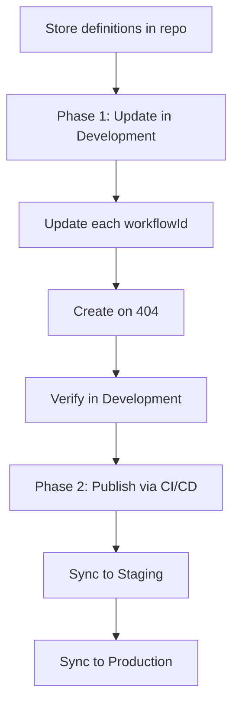

Use the Novu API to keep workflow definitions aligned with your codebase and promote them across environments. The sections below explain the production flow first, then show how to implement each phase.

<Note>
  Workflows are scoped to the environment. The same `workflowId` in Development and Production refers to two separate workflow records. Update definitions in Development, then sync when you are ready to publish. For more on environments, refer to [Publishable assets](/platform/developer/environments#publishable-assets).
</Note>

## How workflow management works in production

Managing workflows in production is a two-phase process. You update workflow definitions in Development from your application code, then you publish those definitions to Staging and Production through CI/CD.

In a real application you usually manage many workflows (for example, `payout-initiated`, `weekly-digest`, and `order-shipped`). The flow is the same for each one: pick a stable `workflowId` per workflow, run the update-first helper for every ID in your list, then sync each ID in CI/CD.

### Phase 1: Update workflow definitions in Development

Store workflow definitions in your repository (steps, payload schema, and channel content). For each `workflowId`, call update first, because that is the path you use on almost every run. Create only when update returns **404** (that workflow does not exist yet in Development).

### Phase 2: Publish workflows to other environments in CI/CD

When definitions in Development are correct, publish them with [Sync a workflow](/api-reference/workflows/sync-a-workflow). Run sync from your CI/CD pipeline (for example, after a merge to `main`) once per `workflowId` so Staging and Production receive the same set of workflows. Use your Development secret key when calling sync. Pass the target environment identifier from the [Novu Dashboard](https://dashboard.novu.co). Each sync copies one workflow from Development into the target environment under the same `workflowId`.

### End-to-end sequence



1. Update workflow definitions in Development for each `workflowId` you manage as code.
2. Publish each workflow from Development to the target environment (Staging first, then Production, if you use both).

## Prerequisites

Install the SDK for your stack and set your secret key from the [Novu Dashboard](https://dashboard.novu.co):

<Tabs>
  <Tab title="Node.js">
    ```bash
    npm install @novu/api zod
    ```
  </Tab>
  <Tab title="Python">
    ```bash
    pip install novu-py
    ```
  </Tab>
  <Tab title="Go">
    ```bash
    go get github.com/novuhq/novu-go
    ```
  </Tab>
  <Tab title="PHP">
    ```bash
    composer require novuhq/novu
    ```
  </Tab>
  <Tab title=".NET">
    ```bash
    dotnet add package Novu
    ```
  </Tab>
  <Tab title="Java">
    Maven:
    ```xml
    <dependency>
      <groupId>co.novu</groupId>
      <artifactId>novu-java</artifactId>
      <version>LATEST</version>
    </dependency>
    ```
  </Tab>
</Tabs>

## Update workflow definitions in Development

This section implements *phase 1*: updating workflow definitions in Development.

For each `workflowId`, try update first and create on **404**:

1. Update the workflow with that `workflowId` and its full definition.
2. If update returns **404**, create a new workflow with the same `workflowId`.

Keep a list of every `workflowId` you manage as code (a constant array, a registry map, or exports from workflow modules) and loop over it in your deploy script or bootstrap job.

<Tabs>
  <Tab title="Node.js">
    ```typescript
    import { Novu } from '@novu/api';

    const novu = new Novu({
      secretKey: process.env.NOVU_SECRET_KEY!,
    });

    /** Every workflowId you manage as code. */
    const MANAGED_WORKFLOW_IDS = [
      "payout-initiated",
      "weekly-digest",
      "order-shipped",
    ] as const;

    /** Build the definition for one workflowId from your in-repo registry. */
    function buildWorkflowDefinition(workflowId: string) {
      return {
        name: "Payout Initiated",
        description: "This workflow is used to initiate a payout",
        tags: ["payout"],
        preferences: { /* ... */ },
        origin: "external" as const,
        validatePayload: false,
        payloadSchema: { /* ... */ },
        steps: [ /* ... */ ],
      };
    }

    export async function createOrUpdateWorkflowInDevelopment(workflowId: string) {
      const definition = buildWorkflowDefinition(workflowId);

      try {
        return await novu.workflows.update(definition, workflowId);
      } catch (error: unknown) {
        const statusCode =
          error && typeof error === "object" && "statusCode" in error
            ? (error as { statusCode: number }).statusCode
            : undefined;

        if (statusCode === 404) {
          return await novu.workflows.create({
            ...definition,
            workflowId,
          });
        }

        throw error;
      }
    }

    export async function createOrUpdateAllWorkflowsInDevelopment() {
      for (const workflowId of MANAGED_WORKFLOW_IDS) {
        await createOrUpdateWorkflowInDevelopment(workflowId);
      }
    }
    ```
  </Tab>
  <Tab title="Python">
    ```python
    import os
    from novu_py import Novu

    MANAGED_WORKFLOW_IDS = (
        "payout-initiated",
        "weekly-digest",
        "order-shipped",
    )

    def build_workflow_definition(workflow_id: str) -> dict:
        return {
            "name": "Payout Initiated",
            "description": "This workflow is used to initiate a payout",
            "tags": ["payout"],
            "origin": "external",
            "validate_payload": False,
            "steps": [],
        }

    def create_or_update_workflow_in_development(workflow_id: str):
        definition = build_workflow_definition(workflow_id)
        with Novu(secret_key=os.environ["NOVU_SECRET_KEY"]) as novu:
            try:
                return novu.workflows.update(workflow_id=workflow_id, update_workflow_dto=definition)
            except Exception as error:
                if getattr(error, "status_code", None) == 404:
                    return novu.workflows.create(create_workflow_dto={**definition, "workflow_id": workflow_id})
                raise

    def create_or_update_all_workflows_in_development():
        for workflow_id in MANAGED_WORKFLOW_IDS:
            create_or_update_workflow_in_development(workflow_id)
    ```
  </Tab>
  <Tab title="Go">
    ```go
    import (
        "context"
        "os"

        novugo "github.com/novuhq/novu-go"
    )

    var managedWorkflowIDs = []string{
        "payout-initiated",
        "weekly-digest",
        "order-shipped",
    }

    func createOrUpdateAllWorkflowsInDevelopment(ctx context.Context) error {
        s := novugo.New(novugo.WithSecurity(os.Getenv("NOVU_SECRET_KEY")))
        for _, workflowID := range managedWorkflowIDs {
            if err := createOrUpdateWorkflowInDevelopment(ctx, s, workflowID); err != nil {
                return err
            }
        }
        return nil
    }
    ```
  </Tab>
  <Tab title="PHP">
    ```php
    use novu;

    $managedWorkflowIds = [
        'payout-initiated',
        'weekly-digest',
        'order-shipped',
    ];

    $sdk = novu\Novu::builder()
        ->setSecurity(getenv('NOVU_SECRET_KEY'))
        ->build();

    foreach ($managedWorkflowIds as $workflowId) {
        try {
            $sdk->workflows->update($workflowId, buildWorkflowDefinition($workflowId));
        } catch (\Exception $e) {
            if ($e->getCode() === 404) {
                $sdk->workflows->create([...buildWorkflowDefinition($workflowId), 'workflowId' => $workflowId]);
            } else {
                throw $e;
            }
        }
    }
    ```
  </Tab>
  <Tab title=".NET">
    ```csharp
    using Novu;

    var managedWorkflowIds = new[] { "payout-initiated", "weekly-digest", "order-shipped" };
    var sdk = new NovuSDK(secretKey: Environment.GetEnvironmentVariable("NOVU_SECRET_KEY")!);

    foreach (var workflowId in managedWorkflowIds)
    {
        try
        {
            await sdk.Workflows.UpdateAsync(workflowId, BuildWorkflowDefinition(workflowId));
        }
        catch (Exception ex) when (ex.Message.Contains("404"))
        {
            await sdk.Workflows.CreateAsync(BuildWorkflowDefinition(workflowId, workflowId));
        }
    }
    ```
  </Tab>
  <Tab title="Java">
    ```java
    import co.novu.Novu;
    import java.util.List;

    List<String> managedWorkflowIds = List.of(
        "payout-initiated",
        "weekly-digest",
        "order-shipped"
    );

    Novu novu = Novu.builder()
        .secretKey(System.getenv("NOVU_SECRET_KEY"))
        .build();

    for (String workflowId : managedWorkflowIds) {
        try {
            novu.workflows().update(workflowId).body(buildWorkflowDefinition(workflowId)).call();
        } catch (Exception e) {
            if (e.getMessage().contains("404")) {
                novu.workflows().create().body(buildWorkflowDefinition(workflowId)).call();
            } else {
                throw e;
            }
        }
    }
    ```
  </Tab>
</Tabs>

For sync request details, refer to [Sync a workflow](/api-reference/workflows/sync-a-workflow).

## Next steps

For individual workflow operations, refer to these guides:

<Columns cols={2}>
  <Card title="Create a workflow" icon="circle-plus" href="/api-reference/workflows/create-a-workflow">
    Create a workflow with the Novu API.
  </Card>
  <Card title="Update a workflow" icon="pencil" href="/api-reference/workflows/update-a-workflow">
    Update a workflow with the Novu API.
  </Card>
  <Card title="Delete a workflow" icon="trash-2" href="/api-reference/workflows/delete-a-workflow">
    Delete a workflow with the Novu API.
  </Card>
  <Card title="Retrieve a workflow" icon="file-search" href="/api-reference/workflows/retrieve-a-workflow">
    Retrieve a workflow with the Novu API.
  </Card>
  <Card title="Sync a workflow" icon="arrow-left-right" href="/api-reference/workflows/sync-a-workflow">
    Sync a workflow with the Novu API.
  </Card>
</Columns>
