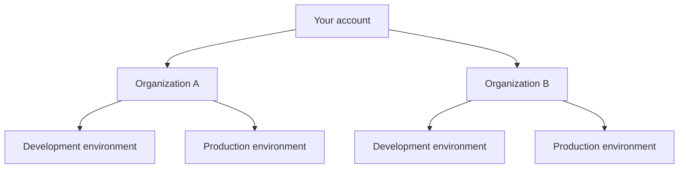

An **organization** is the top-level account in Novu. Workflows, subscribers, integrations, API keys, and team members all belong to an organization and are further scoped to [environments](/platform/how-novu-works#organization-and-environments) within it.

<Note>
  Organization management features such as team invitations, role-based access control, and verified domains are available on Novu Cloud. RBAC requires a Team or Enterprise plan. See [Roles and permissions](/platform/account/roles-and-permissions) for plan details.
</Note>

## How organizations fit in Novu

Each organization is fully isolated. Switching organizations changes which workflows, subscribers, logs, and settings you see in the dashboard—your sign-in session stays the same.

## Creating an organization

When you sign up for Novu Cloud, you are prompted to create your first organization. You can create additional organizations later from the organization switcher in the dashboard sidebar.

Each organization includes:

- **Environments** — Development and Production by default, with custom environments on paid plans.
- **Independent resources** — Workflows, subscribers, topics, integrations, and API keys are scoped per environment.
- **Team membership** — Invite colleagues and assign [roles](/platform/account/roles-and-permissions).
- **Billing** — Subscription plans are tied to the organization. See [Billing](/platform/account/billing).

## Switching between organizations

If you belong to more than one organization, use the **organization switcher** in the sidebar to change context. You can hold different roles in each organization—for example, Owner in your company's org and Viewer in a partner's org.

## Organization settings

Organization owners can manage profile and configuration from **Settings** > **Organization**:

- **Organization name and profile** — Update how your organization appears in the dashboard.
- **Branding and integrations** — Customize Inbox branding on paid plans. See [Prepare for production](/platform/inbox/prepare-for-production).
- **Verified domains** — Allow colleagues with your company email domain to join automatically or by request.

## Verified domains

Verified domains simplify team onboarding. After you verify ownership of a company email domain (for example, `acme.com`), users who sign up with that domain can:

- **Join automatically**, or
- **Request to join**, depending on your organization's configuration.

Approved joiners are assigned the Viewer role by default. Owners review and approve join requests from **Settings** > **Team** > **Requests**.

For step-by-step setup, see [Add a verified domain](/platform/account/manage-members#add-a-verified-domain-for-automatic-or-request-based-onboarding).

<Note>
  Public email domains such as `gmail.com` cannot be verified. At least one Owner must already belong to the domain before verification.
</Note>

## Team access and authorization

Within each organization, access is controlled by roles:

| Topic | Description |
| ----- | ----------- |
| [Roles and permissions](/platform/account/roles-and-permissions) | Owner, Admin, Author, and Viewer roles with a detailed permissions matrix. |
| [Team members](/platform/account/manage-members) | Invite, update roles, and remove members. |
| [SAML SSO & SCIM](/platform/account/sso) | Enterprise SSO and directory sync for centralized provisioning. |

Only **Owners** can invite members, manage verified domains, update billing, and change organization-level settings.

## Enterprise organization features

Enterprise customers on Novu Cloud can extend organization security with:

- **SAML or OIDC SSO** — Sign in through your corporate identity provider.
- **SCIM directory sync** — Automatically provision and deprovision users from Okta, Entra ID, or similar systems.
- **Organization-wide MFA** — Require multi-factor authentication for all members.

Contact [support@novu.co](mailto:support@novu.co) or your Slack Connect channel to enable these features.

## Related topics

<Columns cols={2}>
  <Card title="Authentication" icon="key" href="/platform/account/authentication">
    Sign-in methods, MFA, and session management for Novu Cloud accounts.
  </Card>
  <Card title="How Novu works" icon="sitemap" href="/platform/how-novu-works">
    Architecture overview including organizations and environments.
  </Card>
</Columns>
