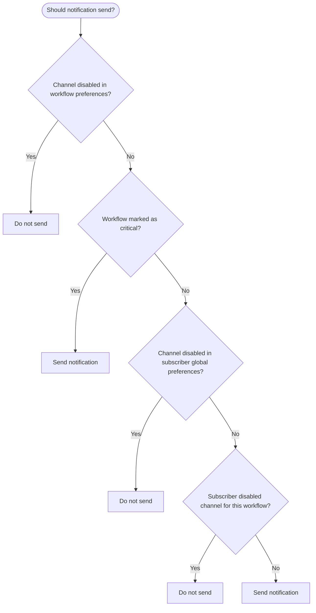

Novu provides a way to store subscriber preferences. This allows subscribers, your users, to specify and manage their preferences and customize their notifications experience.

**Levels of preferences:**

- Workflow channel preferences
- Subscriber channel preferences per workflow
- Subscriber global preferences

## Workflow channel preferences

Each workflow has its own channel preferences. By default, all channel preferences are enabled. If disabled, the subscriber will not receive notifications for that channel step.

Steps to manage workflow channel preferences:

<Steps>
  <Step title="Go to the Workflows page">
    Open the [Workflows page](https://dashboard.novu.co/workflows) in the Novu dashboard.
  </Step>

  <Step title="Select a workflow">
    Click the workflow you want to manage channel preferences for
  </Step>

  <Step title="Open channel preferences">
    A node-based editor will appear. On the right side of the editor, click the `Configure channel preferences` option
  </Step>

  <Step title="Enable or disable all channels">
  </Step>

  <Step title="Configure step preferences">
    You will be able to change the preferences for only those steps which are present in the workflow. Non existing channel steps will be disabled.
  </Step>

  <Step title="Mark as critical (optional)">
    The `Mark as critical` toggle will make this workflow critical. Read more about [critical workflows](#critical-workflows)
  </Step>
</Steps>

<Note>
  If a workflow has only `in-app` and `email` steps, then it will have only `in-app` and `email` preferences.
</Note>

### Critical workflows

In some cases, you don't want the subscriber to be able to unsubscribe from mandatory notifications such as Account Verification, Password Reset, etc...

In those cases, you can mark a workflow as `critical` in the workflow channel preferences. Critical workflows are not displayed in subscriber preferences, so subscribers cannot change preferences for that workflow.

## Subscriber global preferences

Subscribers can set global channel preferences, which override individual settings. For instance, if there are 10 workflows, and a subscriber wants to disable SMS notifications for all of them, they can do so with via global preferences.

## Subscriber channel preferences per workflow

For each workflow, each subscriber has their own channel preferences. Subscribers can manage these preferences from the [`<Inbox />`{" "}](/platform/inbox/configuration/preferences) Preferences view.

<Note>
  Inbox displays only channels present in the current workflow.
</Note>

## Priority of preferences

Since there are three types of preferences, the priority order is as follows:

Workflow channel preferences > Subscriber global preferences > Subscriber channel preferences per workflow

Examples:

1. If the `email` channel is disabled in workflow channel preferences, global and subscriber preferences are ignored, and subscribers will not receive email notifications for this workflow.
2. If the `in-app` channel is enabled in workflow channel preferences but the workflow is marked as critical, subscribers cannot change their preferences and will always receive in-app notifications.
3. If both `chat` and `email` channels are enabled in the workflow but `email` is disabled in subscriber global preferences, the subscriber will receive only chat notifications for this workflow.

## Subscriber preferences APIs

Subscriber preferences can be retrieved and updated using following APIs:

<Columns cols={2}>
  <Card
    title="Retrieve subscriber preferences"
    href="/api-reference/subscribers/retrieve-subscriber-preferences"
    description="Retrieve subscriber preferences for a subscriber"
  />
  <Card
    title="Update subscriber preferences"
    href="/api-reference/subscribers/update-subscriber-preferences"
    description="Update subscriber preferences for a subscriber"
  />
</Columns>
