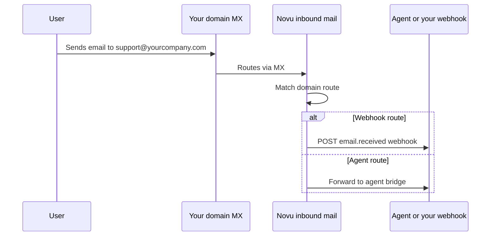

Inbound Email lets you receive mail on addresses you control and route each message inside Novu. Use it to forward replies to your backend via webhooks, or deliver them to an [agent](/agents) for two-way conversations.

<Note>
  Inbound Email domains are available on **Novu Cloud Team plans and above**. On Enterprise self-hosted, configure verified domains and routes in the dashboard. Community self-hosted does not include this feature.
</Note>

## How it works

1. Add and verify a domain in the Novu dashboard (**Domains**).
2. Point your domain's **MX record** to Novu's inbound mail servers.
3. Create **routes** that map local-parts (for example, `support@yourcompany.com`) to a destination.
4. When mail arrives, Novu parses the message and delivers it according to the matching route.

## Add a domain

<Steps>
  <Step title="Open Domains">
    In the Novu dashboard, go to **Domains** and click **Add domain**.
  </Step>

  <Step title="Enter your domain">
    Use a subdomain (for example, `mail.yourcompany.com`) or an apex domain. Apex domains require an MX record at the root; Novu warns if a conflicting CNAME is present.
  </Step>

  <Step title="Verify DNS">
    Add the MX record (and any other records) shown in the dashboard. Novu checks verification automatically; you can also click **Verify** to re-check.
  </Step>

  <Step title="Optional: Domain Connect">
    If your DNS host supports Domain Connect, use **Auto-configure** to apply MX records in one step (supported providers include Cloudflare and Vercel).
  </Step>
</Steps>

When the domain status is **Verified**, you can create routes.

## Route types

Each route matches an address local-part on your verified domain:

| Route type | Destination | Use when |
| --- | --- | --- |
| **Agent** | An agent in your environment | Users email your agent; replies are handled by [ACI](/agents/get-started/what-is-aci) and your agent handler |
| **Webhook** | Your outbound webhook endpoints | You want to process inbound mail in your own backend |

### Catch-all routes

Set the local-part to `*` to match any address on the domain that does not have a more specific route. Useful for `anything@yourcompany.com` routing.

### Route metadata

Each route supports optional JSON **metadata**. Novu includes this metadata in webhook payloads under `route.data`, so you can pass tenant IDs, product slugs, or routing hints without encoding them in the email address.

## Webhook routes and email.received

When a message matches a **Webhook** route, Novu emits an [`email.received`](/platform/developer/webhooks/event-types#email-events) event to your configured [webhook endpoints](/platform/developer/webhooks/webhooks).

Enable webhooks in the dashboard under **Webhooks**, create an endpoint, and subscribe to **email.received**.

The event payload includes normalized mail fields (from, to, subject, text, html, headers, attachments, threading headers) plus your domain and route metadata. See [Event types — Email events](/platform/developer/webhooks/event-types#email-events) for the full schema.

<Warning>
  Do not confuse **Inbound Email** with [Email Activity Tracking](/platform/integrations/email/activity-tracking). Activity tracking receives **delivery and engagement events** (delivered, opened, clicked) from your outbound email provider. Inbound Email receives **messages users send to you**.
</Warning>

## Agent routes

When a message matches an **Agent** route, Novu forwards it to the selected agent's email integration. Your agent handler receives the message on your [bridge URL](/agents/custom-code-agent/setup-your-agent/overview) and can reply with `ctx.reply()`.

For quick setup on Novu Cloud, agents can also use the shared `@agentconnect.sh` inbox provisioned during `npx novu connect`. For production, add a custom domain route so users email `@yourcompany.com`.

See [Agents and providers — Email](/agents/get-started/agents-and-providers) and [Custom code agent setup](/agents/custom-code-agent/setup-your-agent/overview).

## Test a route

On the domain detail page, open a route and use **Send test** to simulate an inbound message. Confirm delivery in **HTTP Logs** (source: `inbound_email`) or on your webhook endpoint.

## Related

<Columns cols={2}>
  <Card icon="webhook" href="/platform/developer/webhooks/webhooks" title="Webhooks">
    Configure endpoints and subscribe to email.received.
  </Card>
  <Card icon="bot" href="/agents/conversations" title="Agent conversations">
    Platform capabilities for agent replies across channels.
  </Card>
</Columns>
