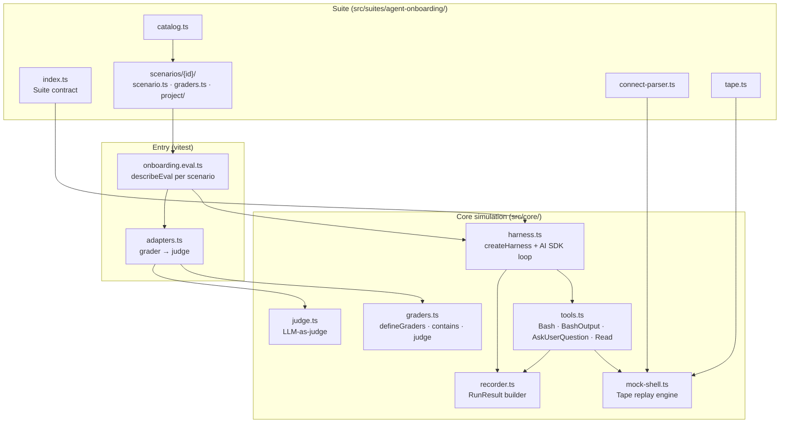
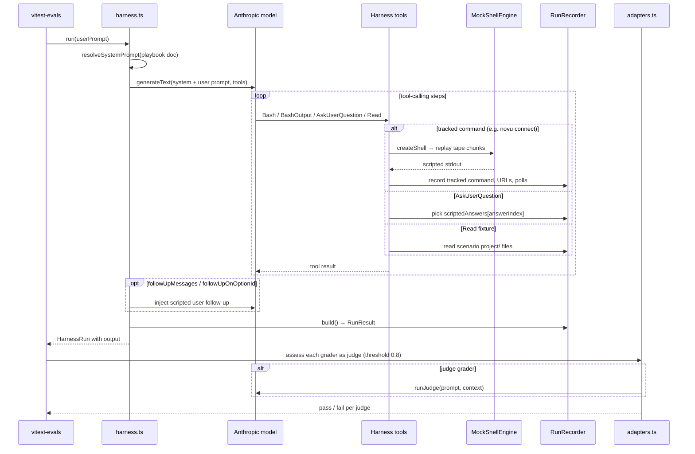

# @novu/agent-evals

Behavioral eval harness for Novu coding-agent playbooks. Runs a real LLM agent against scripted scenarios with a mocked CLI, then grades whether the agent follows the playbook using deterministic structural checks plus optional LLM-as-judge graders for fuzzy criteria.

The harness is **suite-based**: `src/core/` holds the playbook-agnostic simulation layer (mock tools, tape replay, recorder), and each suite under `src/suites/` plugs in its system prompt, command parser, scenarios, and grader catalog. Scoring and reporting are handled by [vitest-evals](https://vitest-evals.sentry.dev/).

The first suite, `agent-onboarding`, tests `@novu/shared/docs/agent-onboarding.md` (the `npx novu connect` flow), resolved via the `@novu/shared` package export.

## Architecture

### Layer overview



### Execution flow

Each scenario is a vitest-evals `describeEval` block: one harness run, then automatic judges score the resulting `RunResult`.



### Key concepts

| Concept | Role |
| --- | --- |
| **Suite** | Plugs a playbook (system prompt), `CommandParser`, scenario list, and optional hooks into the harness. |
| **Scenario** | One eval case: user prompt, fixture `project/`, scripted user answers, optional CLI **tape**, and follow-up messages. |
| **Tape** | Ordered stdout chunks replayed when the agent runs a tracked command; `when(parsed)` can branch on parsed flags. |
| **CommandParser** | Decides which shell commands are tracked (e.g. `novu connect`) and parses them for tape selection and validation. |
| **RunResult** | Everything the agent did: tool calls, assistant text, captured URLs, polled/killed shells, suite metadata. |
| **Graders / judges** | **Deterministic** checks on `RunResult`, or **judge** graders that call a second LLM pass. Adapted to vitest-evals `createJudge` via `adapters.ts`. |

## Structure

```text
src/
  core/                 # suite-agnostic simulation
    types.ts            # Suite contract, RunResult, Tape, CommandParser
    tools.ts            # Bash / BashOutput / AskUserQuestion / Read
    mock-shell.ts       # tape replay engine
    recorder.ts         # RunResult builder
    graders.ts          # defineGraders, contains, matches, judge
    judge.ts            # LLM-as-judge (Anthropic via AI SDK)
  suites/
    agent-onboarding/
      index.ts          # the Suite object
      harness.ts        # createHarness + multi-turn agent loop
      adapters.ts       # grader → vitest-evals judge
      onboarding.eval.ts # describeEval per scenario
      connect-parser.ts
      tape.ts
      catalog.ts
      graders.test.ts   # synthetic RunResult unit tests
      scenarios/<name>/ # scenario.ts + graders.ts + project/ fixtures
vitest.config.ts        # unit tests (*.test.ts)
vitest.evals.config.ts  # evals (*.eval.ts) + vitest-evals reporter
```

## Setup

```bash
cp .env.example .env   # from libs/agent-evals/
pnpm install
```

Set `ANTHROPIC_API_KEY` in `.env` before running evals. Eval suites skip automatically when the key is missing.

## Local commands

**Unit tests** (no API key — synthetic `RunResult` grader checks):

```bash
pnpm --filter @novu/agent-evals test
```

**Evals** (requires `ANTHROPIC_API_KEY`):

```bash
pnpm --filter @novu/agent-evals eval
pnpm --filter @novu/agent-evals eval:watch

# Single scenario
pnpm --filter @novu/agent-evals exec vitest run --config vitest.evals.config.ts -t keyless-slack-secure
```

## Environment variables

| Variable | Description |
| --- | --- |
| `ANTHROPIC_API_KEY` | Required for eval runs (suites skip when unset) |
| `NOVU_EVAL_MODEL` | Agent model (default: `claude-sonnet-4-5`) |
| `NOVU_EVAL_JUDGE_MODEL` | Judge model (default: `claude-sonnet-4-5`) |
| `NOVU_EVAL_CONCURRENCY` | Max scenarios run in parallel (default: `4`) |
| `NOVU_EVAL_MAX_STEPS` | Max agent steps per scenario run (default: `40`) |

Scenarios are independent and dominated by live-model latency, so they run concurrently (`sequence.concurrent`). Raise `NOVU_EVAL_CONCURRENCY` for faster runs or lower it if you hit Anthropic rate limits.

## Threshold semantics

Each scenario uses `judgeThreshold: 0.8` — the average judge score for that scenario must be ≥ 80%. This is stricter than the old global `--fail-under 80` (which gated on the average across all scenarios): every scenario must pass individually.

Judge graders (LLM-as-judge) always run alongside deterministic graders.

## Triage failing scenarios

When a scenario fails, use the Cursor skill `triage-agent-eval-failures` (`.cursor/skills/triage-agent-eval-failures/`) to decide whether the failure is real (playbook regression), a test bug (grader / tape / judge), or flaky (model non-determinism). The skill walks through re-run checks, `RunResult` evidence, and a fix target — playbook vs test scaffolding. Worked examples are in `reference.md` inside that skill directory.

## Adding a new suite

1. Create `src/suites/<name>/` with a `CommandParser`, scenario folders, grader catalog, and `harness.ts`.
2. Export a `Suite` object from `index.ts`.
3. Add `<name>.eval.ts` that loops scenarios and registers `describeEval` blocks.

## CI

GitHub Actions workflow `.github/workflows/agent-evals.yml` runs `pnpm --filter @novu/agent-evals eval` on PRs to `next` that touch the playbook or harness.
